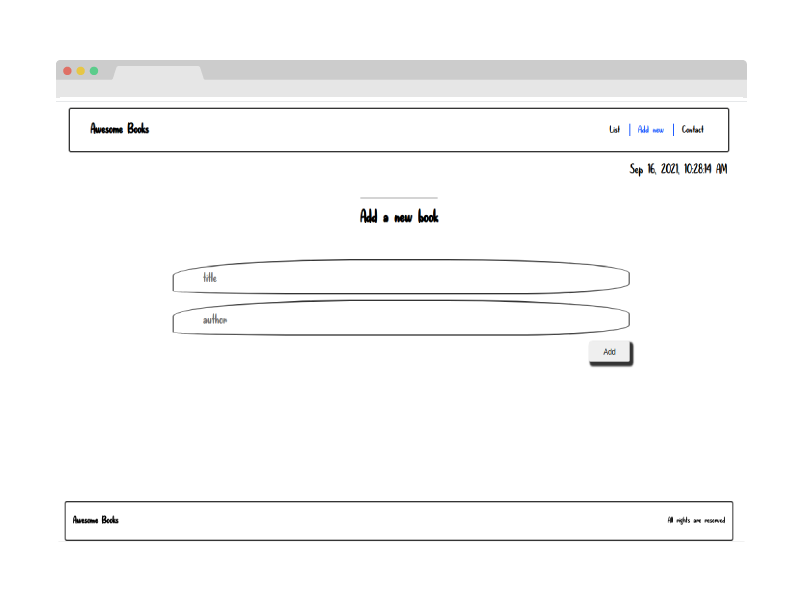
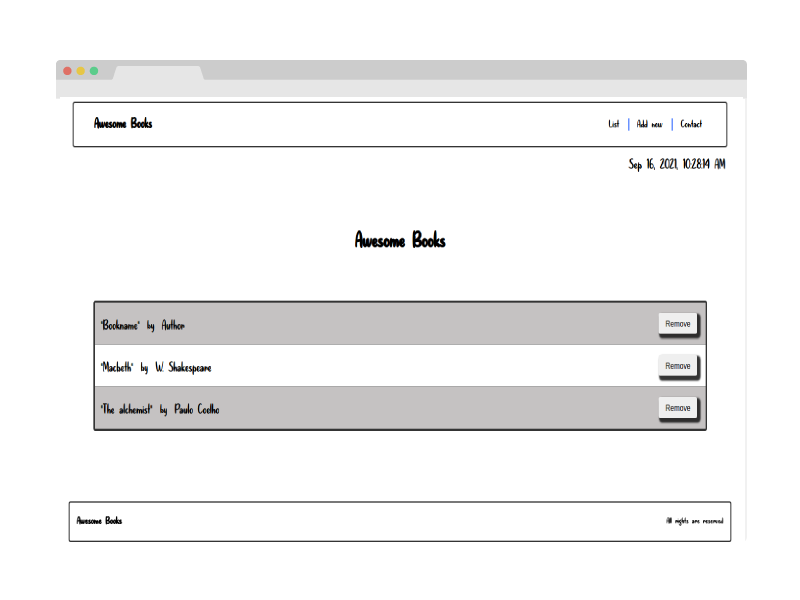
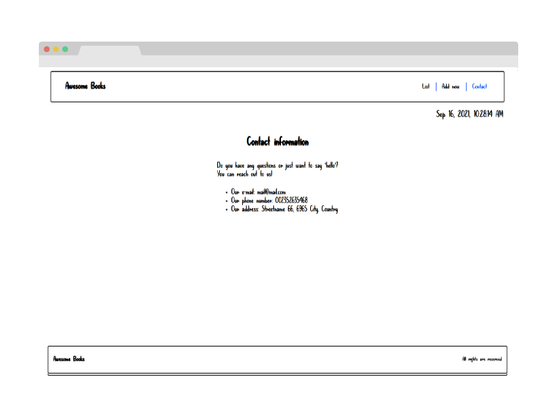

# Project Name

> Booklist App

This is a Microverse project. it's about an app that allows you to create/remove books to a database of books(stored in : local storage)

## Built With

- HTML, CSS, JavaScript
- Vscode

## Live Demo

[Live Demo Link](https://aminehlub.github.io/Awesome-books/)

## Getting Started

To get a local copy up and running follow these simple example steps.

### Prerequisites

- VSCODE / Live HTTP Server

- OS with Git installed on it

### Setup

**Run** git clone https://github.com/AmineHLub/Awesome-books.git

## Authors

👤 **Badr Ben Slama**

- GitHub: [@Goldinium](https://github.com/Goldinium)
- LinkedIn: [LinkedIn](https://www.linkedin.com/in/badrbenslama)

👤 **Mohamed Amine Hajltiaef**
- GitHub: [@AmineHLub](https://github.com/AmineHLub)
- Twitter: [@Amino47612441](https://twitter.com/Amino47612441)
- LinkedIn: [LinkedIn](https://www.linkedin.com/in/mohamed-amine-hajltaief-b18863163/)

## 🤝 Contributing

Any contributing is welcome

Feel free to check the [issues page](https://github.com/AmineHLub/Awesome-books/issues).

## Show your support

Give a ⭐️ if you like this project!

## Acknowledgments

- Hat tip to anyone whose code was used
- Inspiration
- etc

## 📝 License

This project is [MIT](./MIT.md) licensed.
